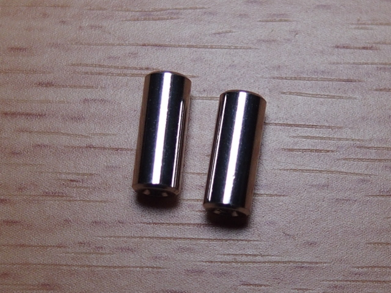

# yacc46 ビルドガイド

## 準備

### キット内容物の確認

| 部品名              | 品番           |  数量   |                      写真                       |
|:--------------------|:---------------|:-------:|:-----------------------------------------------:|
| PCB                 |                |    1    |             |
| トッププレート(FR4)        |                |    1    |        |
| ボトムプレート(乳半アクリル)   |                |    1    |     |
| カバープレート(透明アクリル)   |                |    1    |      |
| タクトスイッチ             | TVAF06-A020B-R |    1    |     |
| OLED(0.96in)        |                |    1    |            |
| ピンソケット(OLED用/4pin) |                |    1    |     |
| ピンヘッダ(OLED用/4pin)  |                |    1    |     |
| LED                 | WS2812B        | 14+予備 |             |
| ダイオード               | 1N4148W        | 46+予備 |           |
| スイッチソケット            |                | 46+予備 |   |
| ネジ                  | M2*5mm         | 28+予備 |           |
| スペーサー(7.5mm)        | M2*7.5mm       |   12    |       |
| スペーサー(10mm)         | M2*10mm        |    2    |        |
| クッションゴム             |                |    8    |  |

OLEDを自前で調達する場合の注意(キット付属のOLEDを使用する場合は無視してください)

0.96インチのOLEDには、ピン配置が異なるものが流通していることを確認しています。
**本キットに使用できるOLEDは、ピンを下側に向けたとき、左側からSDA-SCL-VCC(VDD)-GNDの順に並んでいるものです。**
OLEDを自前で調達する場合は、ピン配置をよく確認してください。

### キット以外に用意するもの

#### 部品

- ProMicro(5V/16MHz) 1個
- コンスルー(ProMicro用) 2本
- MicroUSBケーブル 1本
  - ProMicroとPCの接続用。充電専用ではなく、通信ができるもの。
- Cherry MX互換キースイッチ 44-46個
- キーキャップ(Cherry MXスイッチ用, 1uサイズ) 44-46個
  - 全て1uサイズです。下記の「親指部分に使用するキーキャップについて」を確認の上で用意してください。
- (オプション)ロータリーエンコーダ・ノブ 0-2個
  - 特定のキーの位置に、キースイッチの代わりにロータリーエンコーダを取り付けられます。
  - ALPS EC11シリーズ互換のロータリーエンコーダ(縦型・プッシュスイッチ使用可)が使用できます。  
    (Bourns PEC11R-4020F-S0024 などで動作することを確認しています)

#### 親指部分に使用するキーキャップについて

キーキャップの組み合わせによっては、親指下キーが邪魔になって親指中央キーが押しづらいことがあります。**親指中央キーに背の高いキーキャップを使用する、または親指下キーに背の低いキーキャップを使用する**ことで、キーの高さに差をつけることを強くおすすめします。

参考として、作者が問題なく使用できたキーキャッププロファイルの組み合わせを紹介します。(R4をZの行、R2をQの行としています。)

|       親指中央キー        |   | 親指下キー  |
|:-----------------------:|:-:|:---------:|
|     Cherryプロファイル R2     | + |   同 R4   |
| MT3プロファイル R0(上下逆向き) | + |   同 R4   |
|    MDAプロファイル Convex     | + |   同 R4   |
|     IDOBAO MAプロファイル     | + | XDAプロファイル |

|              MDA Convex + R4 の装着例              |             IDOBAO MA + XDA の装着例              |
|:-------------------------------------------------:|:------------------------------------------------:|
|  |  |

#### 道具・消耗品

- はんだごて
  - LEDを取り付ける場合は、温度調整機能付きのものが必須です。
    それ以外の部品をはんだ付けするときも、温度が上がりすぎないことにより作業がしやすくなるため、温度調整機能付きのものが便利です。
- (あると便利)替こて先
  - はんだごてに最初からついてくるこて先(B型)でもはんだ付けはできますが、表面実装部品のはんだ付けでは細かい部分を加熱する必要があるため、こて先を変えると作業しやすくなります。
  1.6D型がおすすめ。
- こて台・こて先クリーナー
- はんだ付け作業マット
- 糸はんだ
  - 0.8mm or 0.6mmの有鉛はんだがおすすめ。
- フラックス
  - ダイオードやLEDに表面実装部品を使用しています。糸はんだにもフラックスは含まれていますが、別途用意しておくとはんだ付けがしやすくなります。
- フラックスクリーナー
- はんだ吸い取り線
- ティッシュ
- ピンセット
- (あると便利)逆作用ピンセット
- ニッパー
- プラスドライバー
- (あると便利)マルチテスター
- マスキングテープ
- エポキシ接着剤
  - ProMicroのUSBコネクタの補強に使います。
- 絶縁ビニールテープ
  - OLED裏面の絶縁に使います。
- (オプション)サインペン黒
  - マッキーやポスカなど。PCB側面を塗るのに使います。

### はんだ付けのイメージトレーニングをする

本キットの組み立てで、初めて、または久しぶりにはんだ付けをするという方もいるかと思います。
はんだ付けに不安がある方は、組み立てに取りかかる前にはんだ付けの方法を学んでおきましょう。
その上で、よい道具(**温度調整機能付きのはんだごてと替こて先**)を使うことで、はんだ付けの難易度は劇的に下がりますよ。

はんだ付けの基本、スルーホール部品のはんだ付け(本キットではProMicroやロータリーエンコーダなど)については、下記の記事が参考になります。

- [電子工作のコツ/はんだ付け | 村田製作所 技術記事](https://article.murata.com/ja-jp/article/soldering)
- [01　はじめに･･はんだ付けが上手にできないのは腕のせい？ - ゴッドはんだ株式会社](https://godhanda.co.jp/blog/kisokouza01/)

表面実装部品のはんだ付け(本キットではLEDやダイオードなど)については、下記の記事・動画が参考になります。

- [15 チップ部品のはんだ付け（表面実装） - ゴッドはんだ株式会社](https://godhanda.co.jp/blog/kisokouza15/)
- [【Q&A便動画】SMD部品のはんだ付け[基本編] - YouTube](https://www.youtube.com/watch?v=kttUKTgxbGU)

## 組み立て

### ProMicroのUSBコネクタを補強する

ProMicroのMicroUSBコネクタは、無理な力を加えると外れてしまうことがあります。
事前にエポキシ接着剤で補強しておくことをおすすめします。
硬化するまで少し時間がかかるので、最初にやってしまいましょう。

### タクトスイッチ(リセットスイッチ)をはんだ付けする

PCB裏側中央上部の「RESET」とシルク印刷されている箇所にはんだ付けします。

タクトスイッチに向きの区別はありません。

<table>
  <tr>
    <td width="400"></td>
    <td>片側のパッドに予備はんだを盛ります。</td>
  </tr>
  <tr>
    <td></td>
    <td>PCBの位置合わせ用穴にタクトスイッチの突起が合うよう置きます。 タクトスイッチがPCBに密着するようにピンセットで押さえながら、予備はんだを融かしてはんだ付けします。 もう片側のパッドもはんだ付けします。</td>
  </tr>
</table>

### ダイオードをはんだ付けする

PCB裏側、D1-46の46箇所にダイオードをはんだ付けします。

**ダイオードには向きがあります**。
ダイオード表面の縦線「｜」が入った側(カソード)が、シルク印刷されたマーク「▷|」の「｜」側にくるようにはんだ付けします。
なお、yacc46では全てのダイオードが右を向くようになっています。

<table>
  <tr>
    <td width="400"></td>
    <td>片方のパッドにフラックスを少量つけ、予備はんだを盛ります。 あまり多く盛りすぎないようにします。</td>
  </tr>
  <tr>
    <td></td>
    <td>ダイオードの向きを確認します。 ダイオードの縦線と、シルクの縦線の向きを合わせます。</td>
  </tr>
  <tr>
    <td></td>
    <td>予備はんだを加熱しながら、ダイオードの端子を滑り込ませるようにしてはんだ付けします。 逆作用ピンセットを使うと、力を入れずにダイオードを保持できるので便利です。</td>
  </tr>
  <tr>
    <td></td>
    <td>反対側のパッドもはんだ付けします。 加熱しすぎではんだにツノが立ってしまった場合は、フラックスを少量つけてから温めるときれいになります。</td>
  </tr>
</table>

<!-- 片側のパッドにフラックスを少量つけ、予備はんだを盛る(多く盛りすぎないよう注意) -> ダイオードの向きを確認 -> 予備ハンダを加熱しながら、ダイオードの端子を滑り込ませてはんだ付け(逆作用ピンセットを使うと、力を入れずにダイオードを保持できるので便利) -> PCBを逆向きにして、反対側のパッドもはんだ付け -->

### ProMicroを取り付ける

ProMicroを、PCB表側に取り付けます。

シルク印刷のピン配置に合わせて、ProMicroの部品がない面を上に向けて取り付けます。

**コンスルーを使用する場合、PCBとコンスルーははんだ付けしません**。ProMicroとコンスルーのみはんだ付けします。(ProMicroがコンスルーに対応している場合は、ProMicro側もはんだ付け不要です。ここではコンスルー非対応のProMicroと仮定して説明します。)

<table>
  <tr>
    <td width="400"></td>
    <td>コンスルーには取り付け向きがあるので、向きを確認します。<ul><li>上下は、窓がある側が上(ProMicro側)</li><li>左右は、窓がある側が同じ向き(どちらも右、またはどちらも左)を向くようにする</li></ul></td>
  </tr>
  <tr>
    <td width="400"></td>
    <td>コンスルーをPCBにしっかりと取り付けます。<b>PCB側ははんだ付けしません。</b></td>
  </tr>
  <tr>
    <td width="400"></td>
    <td>シルクに書かれたピン配置に合わせて、ProMicroの部品がない面を上に向けて取り付けます。 ProMicroとコンスルーの各ピンをはんだ付けします。</td>
  </tr>
</table>

### ファームウェアを書き込む

[Remap Keyboard Catalog](https://remap-keys.app/catalog/RhCKMVuQ6vAD3aW7nOul/firmware)
より、"yacc46_via"のファームウェアを書き込みます。

書き込み開始時は、PCB裏面に取り付けたリセットボタンを押してください。
(1回押しても書き込めない場合は、2回連続で押してください。)

もしRemapから書き込めない場合は、こちらの手順でファームウェアを書き込んでください。(クリックで開く)

以下のファイルをダウンロードします。

[yacc46 QMK Firmware(VIA enabled)](https://drive.google.com/file/d/1kHac9_PJxZr1fpzN0hwIx9_E40fHPa9m/view?usp=sharing)

ダウンロードしたファイルを、[QMK Toolbox](https://github.com/qmk/qmk_toolbox) または
[Pro Micro Web Updater](https://sekigon-gonnoc.github.io/promicro-web-updater/index.html)
などを使用してProMicroに書き込みます。
書き込み方については、下記の記事を参考にしてください。  
[（初心者編）自作キーボードにファームウェアを書き込む - 自作キーボード温泉街の歩き方](https://salicylic-acid3.hatenablog.com/entry/qmk-toolbox)

### 一度動作確認する

前の手順でVIA/Remap対応版ファームウェアの書き込みに成功していれば、すでに[Remap](https://remap-keys.app/)で認識される状態になっているはずです。
RemapのTest Matrix機能を使用して、各キーが反応することを確認しておくといいでしょう。

<table>
  <tr>
    <td width="400"></td>
    <td>ProMicroとPCを接続し、<a href="https://remap-keys.app/">Remap</a>を開きます。 「START REMAP FOR YOUR KEYBOARD」というボタン->「+KEYBOARD」を押すと、HIDデバイスへの接続を要求するポップアップが表示されます。 「yacc46」を選択し、「接続」します。</td>
  </tr>
  <tr>
    <td width="400"></td>
    <td>メニューから「Test Matrix Mode」を選択すると、キー入力テスト状態になります。 この状態で、PCB裏面にあるキースイッチソケットをはんだ付けするパッドをピンセットなどでショートさせると、画面上で反応するはずです(PCBを裏返しているため、左右反転します)。 全キーが反応することを確認しておきましょう。</td>
  </tr>
</table>

### (オプション)LEDをはんだ付けする

#### LED用電源を選択し、はんだでブリッジする

PCB裏面、「LED POWER SELECT」と書かれた箇所の2組のパッドのうち、どちらかを選んではんだでブリッジします。
**両方をはんだ付けすると、ProMicroやPCにダメージを与える可能性があります。どちらか片方だけをはんだ付けしてください。**

**5V版ProMicro(通常のProMicro)を使用しているなら、VCCと書かれた側をはんだでブリッジします。RAWと書かれた側は開放されたままにしておきます。**

それ以外のボードを使用している場合は、こちらを参考にどちらかをはんだ付けします。(クリックで開く)

| ProMicroのVCC端子の電圧 | ProMicroのRAW端子の電圧 | はんだ付けするパッド |
|:---------------------:|:---------------------:|:-----------:|
|       3.7-5.3V        |        (不問)         |     VCC     |
|       3.7V未満        |          5V           |     RAW     |

もしはんだ付けするパッドを間違えてしまった場合は、はんだ吸い取り線を使用してはんだを除去してください。

#### LEDをはんだ付けする

PCB裏面、LED1-14の14箇所にLEDをはんだ付けします。
LEDは番号の順に直列に接続されているため、番号の順番どおりにはんだ付けしていきます。

**LEDには向きがあります**。LEDの切り欠きがある角が、シルク印刷の"┌"にくるようにはんだ付けします。
なお、yacc46では全てのLEDで切り欠きが左上を向くようになっています。

また、LEDは熱に弱いため、温度調整機能のあるはんだごてが必要です。
ただしあまり低い温度だとはんだ付けしづらくなりますし、温度が低くても長時間はんだごてを当て続けると壊れる可能性があるため、
320℃程度に設定して手早くはんだ付けします。

LEDのはんだ付けが正しくできているか不安であれば、次項「LEDの動作確認をする」を参考にして、1つはんだ付けするたびに光ることを確認するといいでしょう。

<table>
  <tr>
    <td width="400"></td>
    <td>パッドの1つにフラックスを少量つけ、予備はんだを盛ります。 あまり多く盛りすぎないようにします。</td>
  </tr>
  <tr>
    <td></td>
    <td>LEDの向きを確認します。PCBのシルクとLEDの切り欠きが合う向きで取り付けます。</td>
  </tr>
  <tr>
    <td></td>
    <td>予備はんだを加熱しながら、LEDの端子を滑り込ませるようにしてはんだ付けします。 逆作用ピンセットを使うと、力を入れずにLEDを保持できるので便利です。 長時間はんだごてを当て続けるとLEDが故障する可能性があります。LEDの位置決めに手間取った場合は一度はんだごてを離し、フラックスを足したり、はんだ量を調節したりして、LEDが冷めるのを待ってから再挑戦してください。</td>
  </tr>
  <tr>
    <td></td>
    <td>他3つの端子をはんだ付けします。 パッドとLEDの端子にフラックスをつけてから、はんだごての上ではんだを融かし、そのはんだをパッドと端子に移す、という方法ではんだ付けするとやりやすいと思います。</td>
  </tr>
</table>

#### LEDの動作確認をする

Remap対応ファームウェアを書き込んでいれば、Remapを使用してLEDの動作確認ができます。

<table>
  <tr>
    <td width="400"></td>
    <td>ProMicroとPCを接続し、<a href="https://remap-keys.app/">Remap</a>を開きます。 「Lighting」メニューを開きます。</td>
  </tr>
  <tr>
    <td></td>
    <td>「Effect Mode」で「RGB Test」を選択します。</td>
  </tr>
  <tr>
    <td></td>
    <td>LEDのはんだ付けがうまくできていれば、全LEDが赤->緑->青の順に光るはずです。</td>
  </tr>
</table>

### ソケットをはんだ付けする

PCB裏側、SW1-46の46箇所にソケットをはんだ付けします。

ただし、ロータリーエンコーダが取り付けられるSW19, SW36の2箇所については、ロータリーエンコーダを取り付ける場合はソケットのはんだ付けは不要です。
ソケットが取り付けてあってもロータリーエンコーダを取り付けることは可能ですが、少し作業しづらくなるため、最初からロータリーエンコーダを取り付けるつもりであればソケットははんだ付けしないほうがいいでしょう。
(次項「ロータリーエンコーダをはんだ付けする」もお読みください)

**ソケットには向きがあります**。PCB上のシルクが隠れる向きで取り付けてください。
逆向きに取り付けるとソケットがキースイッチ中央の穴に被り、キースイッチを取り付ける際に干渉します。

<table>
  <tr>
    <td width="400"></td>
    <td>片方のパッドに予備はんだを盛ります。 少し多めに盛っておきます。</td>
  </tr>
  <tr>
    <td></td>
    <td>向きに気をつけて、ソケットを置きます。 予備はんだをした側の端子を加熱して、予備はんだを融かします。同時に、ピンセットの背などでソケットを軽く押さえて、ソケットをPCBに密着させます。</td>
  </tr>
  <tr>
    <td></td>
    <td>もう一方のパッドもはんだ付けします。</td>
  </tr>
</table>

<!-- 片方のパッドに予備はんだを盛る(ソケットについては、少し多めに持っておく) -> ソケット -->

### (オプション)ロータリーエンコーダをはんだ付けする

SW19, SW36の2箇所には、キースイッチの代わりにロータリーエンコーダが取り付けられます。

PCB表面からロータリーエンコーダを差し込み、裏面から飛び出た5本の端子をニッパーで少し切ってからはんだ付けします。
ロータリーエンコーダ左右の固定用足ははんだ付けしません。

なお、ロータリーエンコーダ取り付け位置にソケットをはんだ付けしている場合、ロータリーエンコーダの固定用足とソケットが干渉し、差し込みづらくなります。取り付けは問題なくできるので、強めに押し込んでください。

<b>v0.4の注意点</b>(クリックで開く)

ロータリーエンコーダ上側の端子とダイオードの位置が近くなっています。
ソケットをはんだ付けしている場合は、ロータリーエンコーダの端子がソケットとダイオードに挟まれる形になり、はんだ付けがしづらくなります。
<b>ロータリーエンコーダを取り付ける予定の位置には、ソケットをはんだ付けしないことを強くおすすめします。</b>

<table>
  <tr>
    <td width="400"></td>
    <td>PCBの表側からロータリーエンコーダを差し込みます。 5本の端子が曲がらずにスルーホールを通るよう気をつけてください。</td>
  </tr>
  <tr>
    <td></td>
    <td>PCB裏面から飛び出した5本の端子を軽くニッパーで切ってから、はんだ付けします。</td>
  </tr>
</table>

### OLEDを取り付ける

#### OLED裏面を絶縁する

<table>
  <tr>
    <td width="400"></td>
    <td>OLED裏面は電子部品がむき出しになっているため、ProMicroのコンスルーと接触すると故障の原因となります。 OLED裏面にビニールテープを貼って、絶縁しておきます。</td>
  </tr>
</table>

#### OLEDをはんだ付けする

<table>
  <tr>
    <td width="400"></td>
    <td>PCB表面から、ProMicro下のスルーホールにピンソケットを差し込みます。 マスキングテープで仮止めして、PCB裏面からはんだ付けします。</td>
  </tr>
  <tr>
    <td width="400"></td>
    <td>ピンソケットにピンヘッダを差し込み、OLEDを載せます。 上に飛び出たピンヘッダをニッパーで切断します。</td>
  </tr>
  <tr>
    <td width="400"></td>
    <td>OLEDのピンヘッダをはんだ付けします。 まず1箇所だけはんだ付けし、OLEDが水平になっているかを確認してから残りをはんだ付けします。</td>
  </tr>
</table>

### フラックスクリーナーで掃除する

はんだ付けが必要な作業はここまでです。
PCBがフラックスで汚れているので、フラックスクリーナーを使用してきれいにしましょう。

### PCB・トッププレートの側面をサインペンで塗る

PCBとトッププレートの側面は白っぽくなっているので、サインペンで黒く塗ります。
はんだ付け前に行ってもいいですが、フラックスクリーナーで色落ちして周囲を汚す可能性があるため、
フラックスクリーナーで掃除した後に行うといいでしょう。

この一手間で、完成後の質感がグッと上がるので、ぜひ行うことをおすすめします。

### 組み立てる

<table>
  <tr>
    <td width="400"></td>
    <td>PCB表側中央上部の2箇所に、長いスペーサー(10mm)をネジ止めします。</td>
  </tr>
  <tr>
    <td></td>
    <td>カバープレートの保護シートを剥がし、ネジ止めします。カバープレートには裏表の区別はありません。 裏面を指紋などで汚さないように注意！</td>
  </tr>
  <tr>
    <td></td>
    <td>トッププレートのどちらの面を上にするかを決めます。 トッププレートはどちらの面を上にしても使えます。違いは右下のロゴの有無だけです。 決まったら、トッププレート裏側に短いスペーサー(7.5mm)をネジ止めします。</td>
  </tr>
  <tr>
    <td></td>
    <td>トッププレート表側から、キースイッチをいくつかはめます。 ここではプレートとPCBの位置決め用に、プレート外側に数個だけつけます。</td>
  </tr>
  <tr>
    <td></td>
    <td>トッププレートとPCBを合わせます。 このとき、全てのスペーサーがトッププレートの穴に入るように、また<b>キースイッチの足を曲げないように注意しながら</b>ソケットに差し込み、キースイッチとPCBを密着させます。</td>
  </tr>
  <tr>
    <td></td>
    <td>残りのキースイッチをはめていきます。 キースイッチの足を曲げないよう注意してください。 キースイッチがトッププレートにしっかりはまった状態でキースイッチとPCBが密着するようにします。</td>
  </tr>
  <tr>
    <td></td>
    <td>ボトムプレートの保護シートをはがし、ネジ止めします。ボトムプレートには裏表の区別はありません。 ボトムプレートの外周にクッションゴムを貼り付けます。</td>
  </tr>
</table>

最後に、キーキャップとロータリーエンコーダのノブをつけて完成です！

## カスタマイズ

### QMK Firmwareを直接編集する

OLEDの表示内容をカスタマイズするためには、QMK Firmwareに直接実装する必要があります。

yacc46用のファームウェアはまだQMK Firmware公式にマージされていないため、[1m38/qmk_firmware](https://github.com/1m38/qmk_firmware)リポジトリの[yacc46 ブランチ](https://github.com/1m38/qmk_firmware/tree/1m38/yacc46/keyboards/yacc46)を使用してください。

### Keyboard Layout Editorデータ

[Keyboard Layout Editorデータ](http://www.keyboard-layout-editor.com/#/gists/4b6eedf77b86c0a7b8e6e739920f2301)

### VIA/Remap用定義ファイル

[VIA/Remap用定義ファイル(json)](../via/yacc46.json)

### プレート用図面データ

トッププレート・ボトムプレートの図面データ(SVG)を公開しています。
自分でアクリルをカットしてプレートを交換したい場合など、ご自由に編集してお使いください。

[プレートデータ(v0.4/v1.0共通)](../plate_v1.0)
