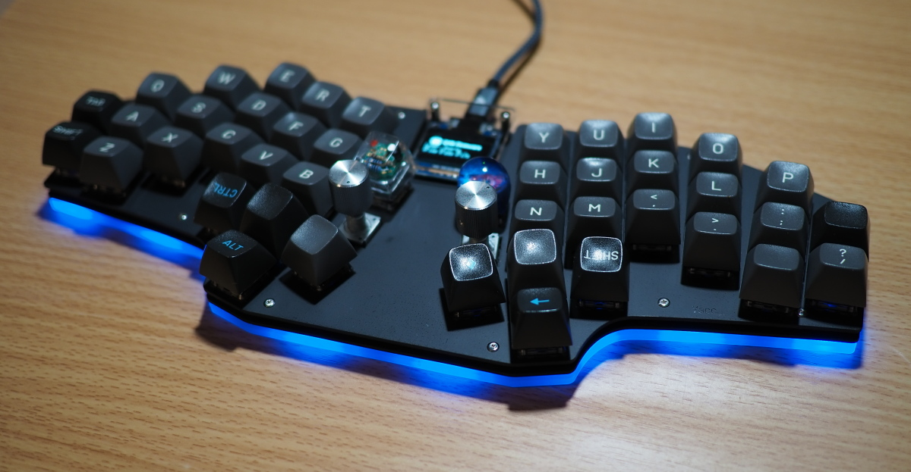

# yacc46

yacc46 is a 44-46keys self-made keyboard.

- [ビルドガイド(日本語)](./docs/buildguide_ja.md)
- [Full-scale drawing](./plate_v0.4/yacc46_fullscale_drawing.pdf)
- [Plate data(SVG)](./plate_v0.4)
- [Schematic](./schema.pdf)
- [KiCad PCB project](./yacc46.pro)
- [QMK Firmware](https://github.com/1m38/qmk_firmware/tree/1m38/yacc46/keyboards/yacc46)

## Notes

The yacc46 PCB project uses these libraries.

- [foostan/kbd](https://github.com/foostan/kbd)

The yacc46 logo uses the [JetBrains Mono](https://github.com/JetBrains/JetBrainsMono) font with some modifications.
